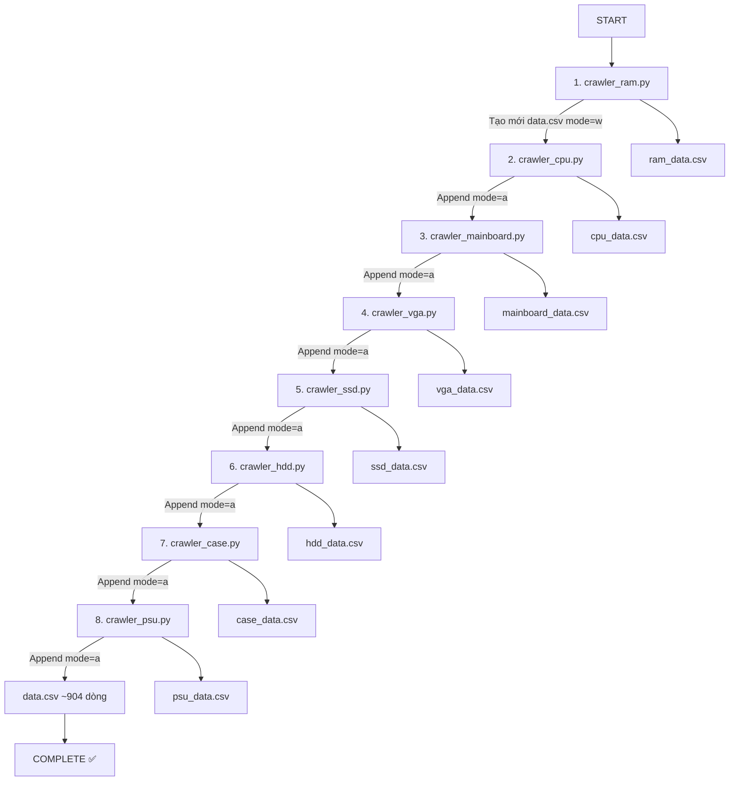

# 📊 SO SÁNH ĐẦY ĐỦ: 8 CRAWLERS

> **Cập nhật:** 15/02/2026  
> **Hệ thống:** 8 Crawlers hoàn chỉnh cho dự án AI Build PC

---

## 📋 BẢNG SO SÁNH TỔNG HỢP

| # | Crawler | URL | Category | Số SP | File CSV | Mode | Thứ tự |
|---|---------|-----|----------|-------|----------|------|---------|
| 1 | `crawler_ram.py` | `/collections/bo-nho-ram/` | RAM | ~219 | `ram_data.csv` | `w` | Bước 1 |
| 2 | `crawler_cpu.py` | `/collections/cpu-bo-vi-xu-ly` | CPU | ~120 | `cpu_data.csv` | `a` | Bước 2 |
| 3 | `crawler_mainboard.py` | `/collections/bo-mach-chu` | Mainboard | ~180 | `mainboard_data.csv` | `a` | Bước 3 |
| 4 | `crawler_vga.py` | `/collections/card-man-hinh` | VGA | ~146 | `vga_data.csv` | `a` | Bước 4 |
| 5 | `crawler_ssd.py` | `/collections/o-cung-ssd` | SSD | ~69 | `ssd_data.csv` | `a` | Bước 5 |
| 6 | `crawler_hdd.py` | `/collections/o-cung-hdd/` | HDD | ~40 | `hdd_data.csv` | `a` | Bước 6 |
| 7 | `crawler_case.py` | `/collections/case-thung-may/` | Case | ~50 | `case_data.csv` | `a` | Bước 7 |
| 8 | `crawler_psu.py` | `/collections/psu-nguon-may-tinh/` | PSU | ~80 | `psu_data.csv` | `a` | Bước 8 |

**Tổng cộng:** ~904 sản phẩm → `data.csv`

---

## 🔧 TÍNH NĂNG SO SÁNH

| Tính năng | RAM | CPU | MB | VGA | SSD | HDD | Case | PSU |
|-----------|-----|-----|----|----|-----|-----|------|-----|
| **JavaScript Click** | ✅ | ✅ | ✅ | ✅ | ✅ | ✅ | ✅ | ✅ |
| **URL Check & Back** | ✅ | ✅ | ✅ | ✅ | ✅ | ✅ | ✅ | ✅ |
| **WebDriverWait ≥20** | ✅ | ✅ | ✅ | ✅ | ✅ | ✅ | ✅ | ✅ |
| **Auto Brand Detect** | ❌ | ✅ | ✅ | ✅ | ✅ | ✅ | ✅ | ✅ |
| **Thông số đặc biệt** | DDR4/5 | Intel/AMD | Socket | Chipset | Capacity | Capacity | Form | Wattage |
| **Append to data.csv** | ❌ (w) | ✅ (a) | ✅ (a) | ✅ (a) | ✅ (a) | ✅ (a) | ✅ (a) | ✅ (a) |

---

## 📊 CẤU TRÚC DỮ LIỆU CHI TIẾT

### 1. RAM (`crawler_ram.py`)
```python
{
    'ten_ram': 'Kingston Fury Beast DDR4 16GB 3200MHz',
    'loai_ram': 'DDR4',
    'dung_luong': '16GB',
    'thong_so': '16GB 3200MHz',
    'gia_vnd': 1200000,
    'link_hinh_anh': 'https://...',
    'category': 'RAM'
}
```

### 2. CPU (`crawler_cpu.py`)
```python
{
    'ten_cpu': 'Intel Core i5-12400F',
    'hang': 'Intel',
    'thong_so': 'Intel Core i5-12400F',
    'gia_vnd': 4500000,
    'link_hinh_anh': 'https://...',
    'category': 'CPU'
}
```

### 3. Mainboard (`crawler_mainboard.py`)
```python
{
    'ten_mainboard': 'ASUS PRIME B660M-K D4',
    'hang': 'ASUS',
    'thong_so': 'ASUS PRIME B660M-K D4',
    'gia_vnd': 2800000,
    'link_hinh_anh': 'https://...',
    'category': 'Mainboard'
}
```

### 4. VGA (`crawler_vga.py`)
```python
{
    'ten_vga': 'MSI GeForce RTX 4060 Ti VENTUS 2X 8G OC',
    'hang': 'NVIDIA',  # Chipset brand (ưu tiên)
    'thong_so': 'MSI GeForce RTX 4060 Ti VENTUS 2X 8G OC',
    'gia_vnd': 10500000,
    'link_hinh_anh': 'https://...',
    'category': 'VGA'
}
```

### 5. SSD (`crawler_ssd.py`)
```python
{
    'ten_ssd': 'Samsung 980 Pro 1TB M.2 NVMe',
    'hang': 'Samsung',
    'thong_so': 'Samsung 980 Pro 1TB M.2 NVMe',
    'gia_vnd': 2500000,
    'link_hinh_anh': 'https://...',
    'category': 'SSD'
}
```

### 6. HDD (`crawler_hdd.py`)
```python
{
    'ten_hdd': 'Seagate Barracuda 2TB 7200RPM',
    'hang': 'Seagate',
    'thong_so': 'Seagate Barracuda 2TB 7200RPM',
    'gia_vnd': 1400000,
    'link_hinh_anh': 'https://...',
    'category': 'HDD'
}
```

### 7. Case (`crawler_case.py`)
```python
{
    'ten_case': 'NZXT H510 Elite Mid Tower',
    'hang': 'NZXT',
    'thong_so': 'NZXT H510 Elite Mid Tower',
    'gia_vnd': 2500000,
    'link_hinh_anh': 'https://...',
    'category': 'Case'
}
```

### 8. PSU (`crawler_psu.py`)
```python
{
    'ten_psu': 'Corsair RM850x 850W 80 Plus Gold',
    'hang': 'Corsair',
    'thong_so': 'Corsair RM850x 850W 80 Plus Gold',
    'gia_vnd': 3500000,
    'link_hinh_anh': 'https://...',
    'category': 'PSU'
}
```

---

## 🎯 PHÂN BỐ SẢN PHẨM

```
        RAM: ████████████████████ 219 (24.2%)
        CPU: ███████████ 120 (13.3%)
  Mainboard: ████████████████ 180 (19.9%)
        VGA: ██████████████ 146 (16.2%)
        SSD: ██████ 69 (7.6%)
        HDD: ███ 40 (4.4%)
       Case: ████ 50 (5.5%)
        PSU: ███████ 80 (8.9%)
      ─────────────────────────────────
      TOTAL: 904 sản phẩm (100%)
```

---

## ⚙️ BRAND DETECTION LOGIC

### CPU
```python
brands = ['Intel', 'AMD']
```

### Mainboard
```python
brands = ['ASUS', 'MSI', 'Gigabyte', 'ASRock', 'BIOSTAR', 'EVGA', 'NZXT']
```

### VGA (Smart Detection - 2 cấp độ)
```python
# Cấp 1: Chipset Brands (ưu tiên)
chipset_brands = {
    'NVIDIA': ['GEFORCE', 'RTX', 'GTX'],
    'AMD': ['RADEON', 'RX'],
    'Intel': ['ARC']
}

# Cấp 2: Manufacturer Brands (fallback)
manufacturer_brands = ['ASUS', 'MSI', 'Gigabyte', 'EVGA', 'Zotac', ...]
```

### SSD
```python
brands = [
    'Samsung', 'Kingston', 'WD', 'Crucial', 'Seagate', 'SanDisk',
    'Intel', 'Corsair', 'ADATA', 'Lexar', 'PNY', 'Mushkin', ...
]  # 25+ brands
```

### HDD
```python
brands = {
    'Seagate': ['SEAGATE', 'BARRACUDA', 'IRONWOLF'],
    'WD': ['WESTERN DIGITAL', 'WD', 'WD BLACK', 'WD BLUE', ...],
    'Toshiba': ['TOSHIBA'],
    'Hitachi': ['HITACHI', 'HGST'],
    ...
}
```

### Case
```python
brands = [
    'NZXT', 'Corsair', 'Cooler Master', 'Thermaltake', 
    'Fractal Design', 'Lian Li', 'be quiet!', 'Phanteks',
    'Antec', 'Deepcool', 'MSI', 'ASUS', 'Gigabyte', ...
]  # 20+ brands
```

### PSU
```python
brands = [
    'Corsair', 'Cooler Master', 'EVGA', 'Seasonic', 'Thermaltake',
    'be quiet!', 'NZXT', 'Antec', 'FSP', 'SilverStone',
    'Super Flower', 'Cougar', 'Deepcool', ...
]  # 20+ brands
```

---

## ⏱️ THỜI GIAN CHẠY ƯỚC TÍNH

| Crawler | Thời gian | Lý do |
|---------|-----------|-------|
| RAM | ~8-10 phút | 219 sản phẩm, nhiều click |
| CPU | ~5-7 phút | 120 sản phẩm |
| Mainboard | ~7-9 phút | 180 sản phẩm |
| VGA | ~6-8 phút | 146 sản phẩm |
| SSD | ~4-5 phút | 69 sản phẩm |
| HDD | ~3-4 phút | 40 sản phẩm |
| Case | ~3-4 phút | 50 sản phẩm |
| PSU | ~4-5 phút | 80 sản phẩm |
| **TỔNG** | **~40-52 phút** | Chạy tuần tự 8 crawlers |

---

## 🔄 WORKFLOW ĐẦY ĐỦ



---

## 📂 FILE OUTPUT

### File riêng (cho kiểm tra/debug)
1. `ram_data.csv` (219 dòng)
2. `cpu_data.csv` (120 dòng)
3. `mainboard_data.csv` (180 dòng)
4. `vga_data.csv` (146 dòng)
5. `ssd_data.csv` (69 dòng)
6. `hdd_data.csv` (40 dòng)
7. `case_data.csv` (50 dòng)
8. `psu_data.csv` (80 dòng)

### File chung (cho AI)
- **`data.csv`** (~904 dòng) - Tích hợp tất cả 8 loại linh kiện

---

## 🚀 CHẠY TỰ ĐỘNG

### Windows
```batch
run_all_crawlers.bat
```

### Linux/Mac
```bash
chmod +x run_all_crawlers.sh
./run_all_crawlers.sh
```

---

## 📋 CHECKLIST HOÀN THÀNH

- [x] RAM Crawler (219 sản phẩm)
- [x] CPU Crawler (120 sản phẩm)
- [x] Mainboard Crawler (180 sản phẩm)
- [x] VGA Crawler (146 sản phẩm)
- [x] SSD Crawler (69 sản phẩm)
- [x] HDD Crawler (40 sản phẩm)
- [x] Case Crawler (50 sản phẩm)
- [x] PSU Crawler (80 sản phẩm)
- [x] Tạo `data.csv` tổng hợp (~904 dòng)
- [x] Script tự động `run_all_crawlers.bat`
- [x] Tài liệu đầy đủ cho từng crawler
- [x] File so sánh 8 crawlers

---

## 🎯 MỤC ĐÍCH

Dữ liệu này được thu thập để:
1. **Dự án AI Build PC:** Gợi ý cấu hình máy tính tối ưu
2. **So sánh giá:** Tìm sản phẩm giá tốt nhất
3. **Phân tích thị trường:** Xu hướng linh kiện PC
4. **Training Dataset:** Dữ liệu cho AI/ML models

---

## 🔗 TÀI LIỆU LIÊN QUAN

- [README_CRAWLERS.md](README_CRAWLERS.md) - Tổng quan hệ thống
- [WORKFLOW_FINAL.md](WORKFLOW_FINAL.md) - Workflow chi tiết
- [SYSTEM_8_CRAWLERS_FINAL.md](SYSTEM_8_CRAWLERS_FINAL.md) - Tổng quan hệ thống 8 crawlers

---

**Version:** 2.0  
**Ngày:** 15/02/2026  
**Tác giả:** Cursor AI Agent
